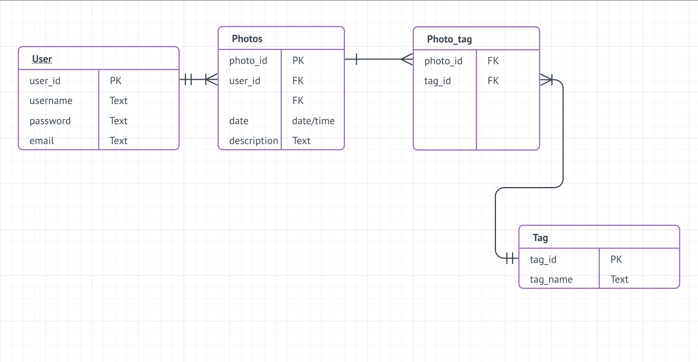

# Project 3 - Design & Plan

Your Name:

## 1. Persona

I've selected **[Tim]** as my persona.

I've selected my persona because Tim has more confidence in his abilities with technologies. For this project, making a photo galley with log in function can be tricky for users. Especially, with an account management, users are required to log in first in order to view photos on this website. However, all other three personas are risk reverse, which means they are less likely to worry about accouns, sign in or sign out. If a viewport prompts out and reminds them of logging in, they probably will feel confused and may stop proceeding their task. Moreover, Tim likes to learn all the functionality of his technologies. Therefore, it is more likely for Tim to fully employ features on this website.

## 2. Sketches & Wireframes

### Sketches

[Insert your sketches here.]


### Wirefames

[Insert your wireframes here.]


[Explain why your design would be effective for your persona. 1-3 sentences.]

This design comes with a little subtlety, but it is still very approachable. Even though this design does not explicitly list out every tab in the menu, a drop down is still very understandable especially for someone like Tim who likes to play with his/her technologies. In addition to a drop down menu, I also designed a filter list to enable users to narrow down images interested them.

## 3. Database Schema Plan

[Describe the structure of your database. You may use words or a picture. A bulleted list is probably the simplest way to do this.]



## 4. Database Query Plan

[Plan your database queries. You may use natural language, pseudocode, or SQL.]
1. I want to make a table that query photos from the Photos table, so that when user clicks into this page, they are able to view all images.
2. The user_id that is queried from the User table will be linked to Photos table as a foreign key.
3. photo_id will be queried from Photos table and linked into Photo_tag as a foreign like
4. tag_name will be queried from Tag table and displayed under each image correspondingly.
5. tag_id will be queried in order to be linked to the tag_id as a foreign key.
6. username will be queried from User table and will be compared with real user's input to see if they are matched.
7. password will be queried from User table and will be compared with real user's input to see if they are matched.
## 5. Structure and Pseudocode

### Structure

[List the PHP files you will have. You will probably want to do this with a bulleted list.]

* index.php - this page will display all images before user logs in. If they logged in, the same page will be refreshed but based on different PHP conditional statements.
* includes/init.php - this page will include several functions that can be applied so every page. At this point, this page will include a function to print out messages when error occurs. And this page also incorporates a function to execute each query.
* includes/header.php - this is a header page will remain the same for every page, but the drop down menu will be different based on PHP conditions.
* includes/footer.php - well, this is a plain footer.
* login.php - this will show a page that allows users to input their username and password in order to log in.
* view_my_picture.php -  this page will be available only if users log into their account. On this page, users will their corresponding images that they have uploaded. At the same time, users will have access to edit their images and tags.

### Pseudocode

[For each PHP file, plan out your pseudocode. You probably want a subheading for each file.]

#### index.php

```
check if user has logged in,
  if they are logged in,
    drop_down_menu will display an option to log out and an option to "view my picture"
  if they are not logged in,
    the index page will remain the same
```

#### includes/init.php

```
messages = array to store messages for user (you may remove this)

DB helper functions (

db = connect to db
```


#### log_in.php

```
check if user types anything into username and passwords
  if they do,
    check if username exists in User table
      if it exists
        check if user input password matches password corresponding to that username
      else tell user they should put some valid username.

```
#### view_my_picture.PHP

```
check if user has logged in
  if logged in,
    show images with corresponding user_id

```
## 6. Seed Data - Username & Passwords

[List the usernames and passwords for your users]

* Leokerry : cornellishard
* Smashpotato: info2300isharder
